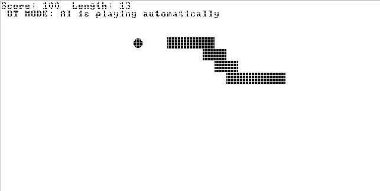

# Automatic Snake Game (Jack Language)



## Overview
This is an automatic Snake game written in the Jack programming language for the Nand2Tetris course (Project 09). The snake moves automatically across the screen, and the player uses arrow keys to control its direction. The goal is to eat food circles to grow longer and increase your score while avoiding walls and the snake's own body.

## Files
- `Main.jack`: Main program entry point that starts the game.
- `SnakeGame.jack`: Game controller that handles user input, game loop, and display.
- `Snake.jack`: Snake logic including movement, collision detection, food generation, and scoring.

## How to Run
1. **Compile the Jack files:**
   Open PowerShell and run:
   ```powershell
   & "C:\Projects\SnakeGame\nand2tetris\tools\JackCompiler.bat" "C:\Projects\SnakeGame"
   ```
   This will generate `.vm` files for each `.jack` file.

2. **Run in the VM Emulator:**
   - Open the VMEmulator:
     ```powershell
     & "C:\Projects\SnakeGame\nand2tetris\tools\VMEmulator.bat"
     ```
   - In the emulator, use `File > Load Program` and select the entire `C:\Projects\SnakeGame` directory.
   - When prompted about OS functions, select "Yes".
   - Set "No Animation" and "Screen" for best performance.
   - Click "Run" or "Fast" to start the game.

## How to Play
- **Manual Mode**: Use the **ARROW KEYS** to change direction:
  - ↑ Up Arrow: Move up
  - ↓ Down Arrow: Move down  
  - ← Left Arrow: Move left
  - → Right Arrow: Move right
- **Bot Mode**: Enter admin password `ADMIN123` when prompted to activate AI bot that plays automatically
- Eat the food circles to grow longer and increase your score
- Avoid hitting the walls or the snake's own body
- Press **Q** to quit the game anytime

## Admin Bot Mode 🤖
- **Password**: `ADMIN123` (case sensitive)
- **AI Features**: 
  - **Simple 2-Step Decision Making**: Calculate direction to food, then check safety
  - **Coordinate Mathematics**: Uses deltaX/deltaY for pathfinding
  - **Collision Avoidance**: Checks walls and self-collision before moving
  - **Fallback Logic**: Finds alternative safe directions when needed
  - **Hands-Free Play**: Completely automated gameplay
- **Perfect for Exam**: Simple, understandable AI that's easy to explain and defend

## Game Features
- **Automatic Movement**: Snake moves continuously without stopping
- **Manual Control**: Responsive arrow key input for human players
- **Simple AI Bot Mode**: Clear 2-step decision algorithm perfect for exam explanation
- **Admin Authorization**: Password-protected bot mode (`ADMIN123`)
- **Collision Detection**: Game ends when snake hits walls or itself  
- **Food System**: Random food generation with collision avoidance
- **Score Tracking**: Points awarded for each food eaten
- **Visual Graphics**: Clean pixel-based graphics using the Jack Screen API
- **Educational Value**: Demonstrates core CS concepts in understandable way

## Technical Details
- **Screen Resolution**: 512x256 pixels (32x16 grid cells)
- **Snake Segments**: 16x16 pixel squares
- **Food**: Circles with 6-pixel radius
- **Game Speed**: Adjustable through move counter (currently every 8 cycles)
- **Maximum Length**: 
  - **Bot Mode**: ~13 segments (AI pathfinding limitations)
  - **Manual Mode**: Up to 200 segments (theoretical maximum - entire screen)
- The game keeps score and displays final score when game ends.

## Customization
You can modify the following aspects of the game:
- Adjust game speed by changing the move counter in `SnakeGame.jack`
- Modify AI behavior in the bot mode decision logic
- Change screen resolution or segment sizes (requires code adjustments)
- Customize the admin password in the bot mode authentication

## Author
Developed for Nand2Tetris Project 09 - adapted and enhanced with the help of GitHub Copilot.
